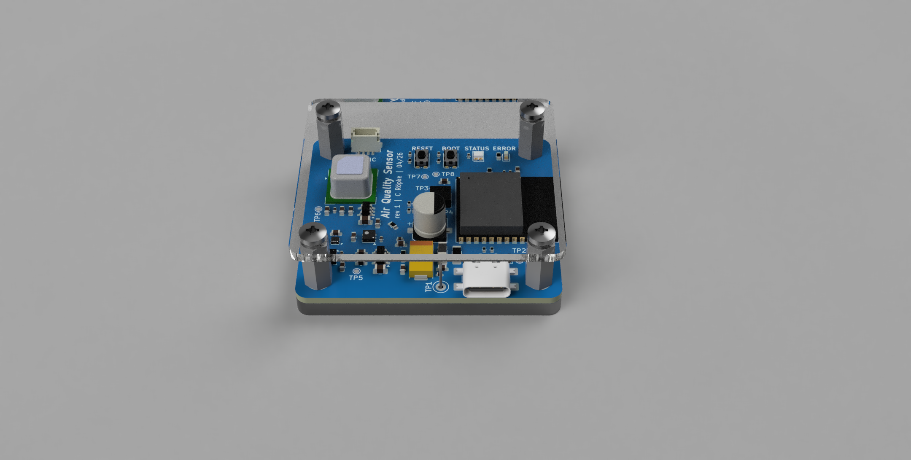
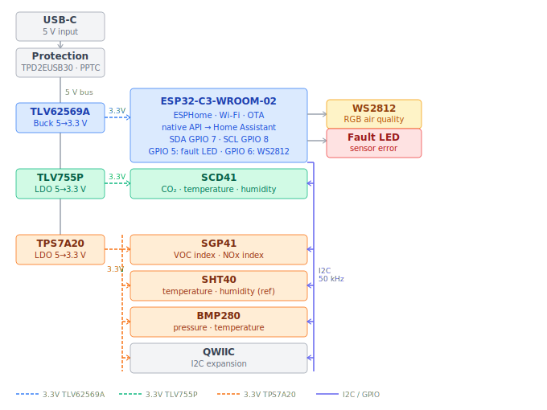
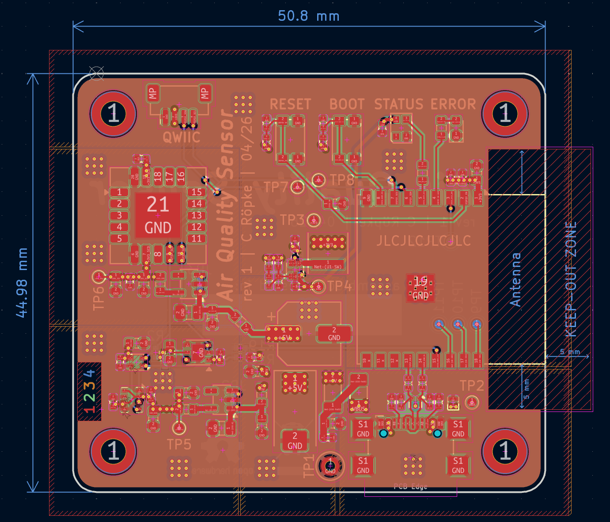
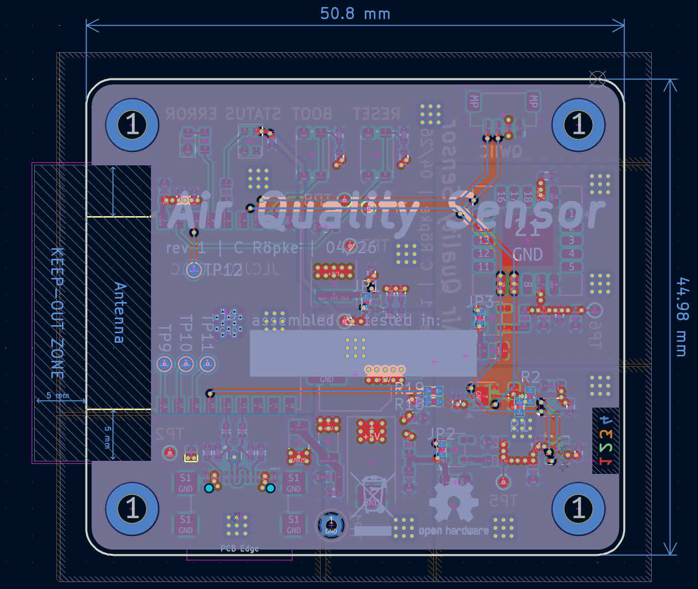
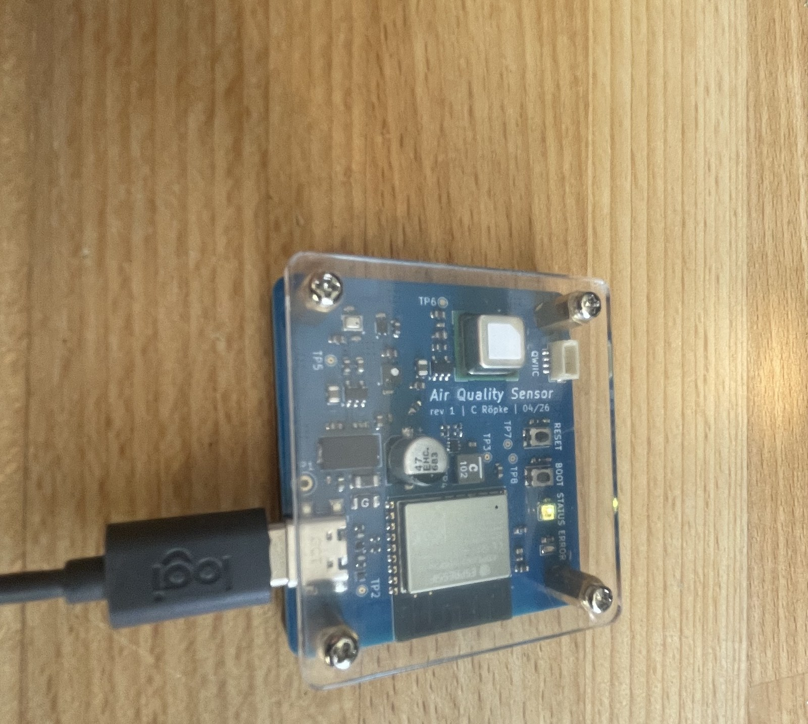

# Air Quality Sensor

A DIY open-source air quality monitor built around an ESP32-C3, featuring a custom 4-layer PCB with four Sensirion/Bosch sensors, a laser-cut glass top panel, and a 3D-printed holder. Firmware runs on [ESPHome](https://esphome.io) and integrates natively with Home Assistant.



---

## Table of contents

- [What it measures](#what-it-measures)
- [System overview](#system-overview)
- [Hardware design](#hardware-design)
  - [Sensors](#sensors)
  - [Power system](#power-system)
  - [PCB](#pcb)
  - [Enclosure](#enclosure)
- [Assembly](#assembly)
  - [Soldering](#soldering)
  - [I2C addresses](#i2c-addresses)
  - [Power-on checklist](#power-on-checklist)
- [Firmware](#firmware)
  - [Getting started](#getting-started)
  - [LED behavior](#led-behavior)
  - [Web interface](#web-interface)
  - [Diagnostic configs](#diagnostic-configs)
- [Manufacturing](#manufacturing)
- [License](#license)

---

## What it measures

| Sensor | Measurements | Notes |
|--------|-------------|-------|
| **Sensirion SCD41** | CO₂ (ppm), temperature, humidity | Primary air quality signal |
| **Sensirion SGP41** | VOC Index (1–500), NOx Index (1–500) | Fallback if SCD41 unavailable |
| **Sensirion SHT40** | Temperature (±0.2 °C), humidity (±1.8 %RH) | Reference for sensor compensation |
| **Bosch BMP280** | Barometric pressure, temperature | CO₂ altitude compensation source |

---

## System overview



The ESP32-C3 sits at the center of the design. All four sensors share a single I2C bus running at 50 kHz. The BMP280 pressure reading feeds the SCD41's ambient pressure compensation input, and the SHT40 temperature and humidity readings feed the SGP41's gas compensation algorithm. This cross-sensor compensation is why all four sensors are present even though some measurements overlap.

---

## Hardware design

### Sensors

**SCD41 — CO₂**

The SCD41 uses photoacoustic NDIR (non-dispersive infrared) technology to measure CO₂ directly. CO₂ is the primary metric for indoor air quality: levels above 1000 ppm are linked to reduced concentration, and above 2000 ppm cause noticeable cognitive effects. The SCD41 includes automatic self-calibration (ASC), which compensates for long-term sensor drift by assuming the sensor sees outdoor-quality air (≈400 ppm) for at least one hour per day. It also accepts an ambient pressure input from the BMP280 to correct for altitude-induced measurement error.

**SGP41 — VOC and NOx**

The SGP41 uses a metal oxide (MOX) sensing element to detect volatile organic compounds and nitrogen oxides. Rather than reporting raw concentrations, it outputs a processed index (1–500) where 100 represents a typical indoor baseline. This makes it well-suited for detecting events like cooking, cleaning products, paint fumes, or combustion without requiring gas-specific calibration. It also serves as the fallback air quality signal when CO₂ data is unavailable — the LED logic prefers CO₂ but degrades gracefully to VOC index.

**SHT40 — Temperature and humidity (reference)**

The SHT40 is the most accurate temperature and humidity sensor on the board. Its readings feed the SGP41's built-in compensation algorithm, which requires accurate ambient conditions to produce reliable VOC and NOx readings. The SHT40 is also the primary source of temperature and humidity data for the Home Assistant dashboard — the SCD41 and BMP280 both have internal temperature sensors, but they run warmer due to self-heating and are less accurate.

**BMP280 — Barometric pressure**

The BMP280 adds barometric pressure, which has two uses: it feeds the SCD41's ambient pressure compensation input (NDIR CO₂ sensors read differently at different altitudes), and it provides weather-correlation data for the Home Assistant dashboard. A secondary temperature reading from the BMP280 is also useful for estimating board self-heating effects.

---

### Power system

The board takes 5 V via USB-C. Any standard USB-C power supply rated ≥1 A works — no USB Power Delivery negotiation is required, and charge-only cables (no data lines) are fine.

The power path is:

**USB-C → TPD2EUSB30 (ESD protection) → PPTC fuse (750 mA self-resetting) → three separate 3.3 V rails**

Three regulators run in parallel off the 5 V bus, each feeding a dedicated load:

- **TLV62569A** (synchronous buck converter) → ESP32-C3. The buck is efficient for the ESP32's variable current draw but produces switching noise, so it feeds only the microcontroller, not the sensors.
- **TLV755P** (LDO) → SCD41. The SCD41's photoacoustic CO₂ measurement is sensitive to supply noise; a dedicated LDO with a higher current rating than the TPS7A20 keeps its rail clean and isolated.
- **TPS7A20** (ultra-low-noise LDO, 10 µVRMS) → SGP41, SHT40, BMP280, and the QWIIC connector. The SGP41's MOX element and SHT40's capacitive humidity sensor are especially susceptible to supply noise; the TPS7A20 keeps all three on a single clean rail, isolated from both the buck and the SCD41's LDO.

The **PPTC fuse** is a self-resetting polyfuse rated at 750 mA, protecting the board against overcurrent faults without requiring manual intervention.

---

### PCB

<table>
  <tr>
    <td></td>
    <td></td>
  </tr>
  <tr>
    <td align="center"><em>Top copper layer</em></td>
    <td align="center"><em>Bottom copper layer</em></td>
  </tr>
</table>


<!-- TODO: add photo of assembled rev 1 board -->

The PCB is a 4-layer board designed in [KiCad](https://www.kicad.org/). Bare boards were manufactured by [JLCPCB](https://jlcpcb.com/) and assembled by hand.

Layer stackup: signal / GND plane / power plane / signal. The dedicated ground and power planes provide clean returns and reduce radiated noise — important given the sensitive gas sensors on the same board.

The board uses a mix of 0402 and 0603 passives, with all ICs in small SMD packages. The custom footprint for the SGP41 (`air_quality_footprints.pretty/`) is included in the repository because it is not in the standard KiCad library.

---

### Enclosure


<!-- TODO: add photo of fully assembled unit (PCB + holder + glass top) -->

The enclosure consists of three parts:

**3D-printed holder** (`hardware/enclosure/air_quality_sensor_holder.f3d`, `.stl`): holds the PCB and provides ventilation for the sensors. Print in PLA or PETG at 0.2 mm layer height.

**Laser-cut glass top** (`hardware/enclosure/air_quality_sensor_glass_top.dxf`, `.step`, `.f3d`): 2 mm clear glass, sourced from [Formulor](https://www.formulor.de) using the provided DXF file.

**Standoffs**: M2.5 × 10 mm male-female hex standoffs (5 mm across flats) mount between the PCB and the glass top. The Fusion 360 model is included at `hardware/enclosure/Standoff mf - M2.5 x 10 across flats 5mm.f3d`.

**Power supply and cable**: any USB-C power supply providing 5 V/1 A or more. A USB-C cable is required — USB-C to USB-A adapters also work with a suitable charger. Photo to be added once a suitable setup is sourced.
<!-- TODO: add photo of USB-C cable + power supply -->

---

## Assembly

### Soldering

All components are SMD. The board was assembled by hand with a soldering iron, flux, and solder paste on the fine-pitch ICs.

Recommended soldering order — smallest and most heat-sensitive first, connectors last:

1. **ESP32-C3-WROOM-02** — the largest IC; solder the pads around the perimeter, then reflow the exposed pad underneath with a hot-air station or by heating the board from below.
2. **TLV62569A, TLV755P, TPS7A20, TPD2EUSB30** — small SOT/WSON packages; drag-solder or use solder paste + hot air.
3. **SGP41** — custom footprint (`air_quality_footprints.pretty/`); ensure the exposed pad underneath is soldered for both mechanical and thermal contact.
4. **SCD41, SHT40, BMP280** — Sensirion LCC packages; reflow carefully, avoid excess heat on the SCD41 optical aperture.
5. **0402/0603 passives** — resistors and capacitors.
6. **USB-C connector, WS2812, LEDs, standoff holes** — connectors and through-board components last.

Use the interactive BOM (`hardware/pcb/air_quality_sensor/bom/ibom.html`) during assembly — it highlights each component on the board overlay and is the easiest way to avoid placing components in the wrong location. Open it locally in any browser, no server required.

The schematic PDF (`hardware/pcb/air_quality_sensor/air_quality_sensor-schematic.pdf`) is the reference for component values and net names.

### I2C addresses

| Sensor | I2C address | Configurable? |
|--------|-------------|---------------|
| SCD41 | 0x62 | No |
| SGP41 | 0x59 | No |
| SHT40 | 0x44 | No |
| BMP280 | 0x76 | Via SDIO pin (0x76 or 0x77) |

The firmware enables I2C bus scanning on boot (`scan: true`). With a serial monitor connected, boot log output will list all detected addresses — a quick way to confirm all four sensors are soldered correctly and communicating before flashing the full config.

### Power-on checklist

Before flashing for the first time:

1. **Visual inspection** — check for solder bridges on the ESP32 and sensor pads under magnification.
2. **Continuity check** — verify no short between the three 3.3V rails, and no short between any rail and GND.
3. **Apply 5V via USB-C** — measure voltage on each 3.3V rail with a multimeter before the ESP32 is powered. Expected: ~3.3V on all three rails.
4. **Check quiescent current** — with sensors powered but ESP32 not yet flashed, current draw should be low (a few mA). A high reading suggests a solder bridge or incorrect component.
5. **Flash firmware** — once voltage rails check out, proceed to the firmware getting started section.
6. **Verify I2C scan** — open the serial monitor and confirm all four sensor addresses appear in the boot log.

---

## Firmware

The firmware is a single [ESPHome](https://esphome.io) YAML configuration. ESPHome compiles it to a native binary for the ESP32-C3 and handles OTA updates, the web server, and the Home Assistant native API automatically.

### Getting started

**Prerequisites:** ESPHome installed (`pip install esphome` or via the Home Assistant add-on).

1. Copy `firmware/secrets.yaml.example` to `firmware/secrets.yaml` and fill in all four values:

   ```yaml
   wifi_ssid: "your-network"
   wifi_password: "your-password"
   api_encryption_key: "your-base64-encryption-key"
   ota_password: "your-ota-password"
   ```

   The `api_encryption_key` is a 32-byte random key used to encrypt the connection between ESPHome and Home Assistant. Generate one with:

   ```bash
   openssl rand -base64 32
   ```

   Alternatively, run `esphome wizard firmware/air-quality-sensor.yaml` and ESPHome will generate and fill in all secrets interactively.

   The `ota_password` can be any string — you'll be prompted for it when pushing firmware updates over the air.

2. Flash via USB (first time):

   ```bash
   cd firmware
   esphome run air-quality-sensor.yaml
   ```

3. All subsequent updates are over-the-air automatically.

**Home Assistant:** once on the network the device is auto-discovered via the native API. Go to Settings → Integrations and accept the discovered device. All sensors, the fault indicator, and the LED control appear as entities immediately.

---

### LED behavior

The WS2812 RGB LED on the board gives an at-a-glance air quality reading. The firmware prefers CO₂ from the SCD41 as the primary signal; if that sensor is unavailable, it falls back to the VOC index from the SGP41.

| Color | CO₂ (preferred) | VOC Index (fallback) |
|-------|-----------------|----------------------|
| 🟢 Green | < 800 ppm | < 150 |
| 🟡 Yellow | 800–1200 ppm | 150–250 |
| 🔴 Red | > 1200 ppm | > 250 |

A second red LED (the fault LED) lights up whenever any sensor stops reporting valid data. It re-evaluates every 30 seconds as a backstop against sensors going silently missing.

---

### Web interface

The device runs a built-in web server on port 80. Navigate to `http://air-quality-sensor.local` (or the device's IP) in any browser on the same network to see all sensor readings and control buttons without Home Assistant.

Diagnostic buttons available in the web UI and in Home Assistant:

| Button | Effect |
|--------|--------|
| **SCD41 Factory Reset** | Clears the SCD41's calibration history and restarts the ESP32. Use if the CO₂ readings look wrong after a long transport or storage period. |
| **Test Fault LED** | Turns the fault LED on for 2 seconds — useful for confirming the LED is soldered and working. |
| **Restart ESP** | Reboots the ESP32. |

If the device cannot reach your Wi-Fi network it falls back to an access point: SSID `Air-Quality Fallback`, password `configureme`. Connect to it and navigate to `http://192.168.4.1` to reconfigure.

---

### Diagnostic configs

Two additional ESPHome configs are included for debugging the SCD41:

| File | Purpose |
|------|---------|
| `diagnostic-scd41-only.yaml` | Runs only the SCD41 in isolation — useful for ruling out I2C address conflicts |
| `diagnostic-scd41-deep.yaml` | Extended SCD41 diagnostics with verbose sensor logging |

Flash a diagnostic config the same way as the main config:

```bash
esphome run firmware/diagnostic-scd41-only.yaml
```

---

## Manufacturing

PCB production files are in `hardware/pcb/air_quality_sensor/jlcpcb/`:

| File | Purpose |
|------|---------|
| `gerber/GERBER-air_quality_sensor.zip` | Upload to JLCPCB (or any fab) to order the bare PCB |
| `production_files/BOM-air_quality_sensor.csv` | Bill of materials — use for sourcing components |
| `production_files/CPL-air_quality_sensor.csv` | Component placement file — reference for hand assembly positioning |

Order the bare PCB from JLCPCB using the Gerber zip. Source components separately (Mouser, LCSC, DigiKey) using the BOM, then assemble by hand — see the [Assembly](#assembly) section above for the recommended process.

The schematic PDF (`hardware/pcb/air_quality_sensor/air_quality_sensor-schematic.pdf`) and interactive BOM (`bom/ibom.html`) are the primary references during assembly.

---

## License

Hardware (PCB schematics, layout, enclosure files) is licensed under the [CERN Open Hardware Licence Version 2 – Strongly Reciprocal (CERN-OHL-S-2.0)](https://ohwr.org/cern_ohl_s_v2.txt).

Firmware is licensed under the [MIT License](https://opensource.org/licenses/MIT).

In short: you can use, modify, and manufacture this design freely — including commercially — as long as any modifications to the hardware are released under the same licence.
